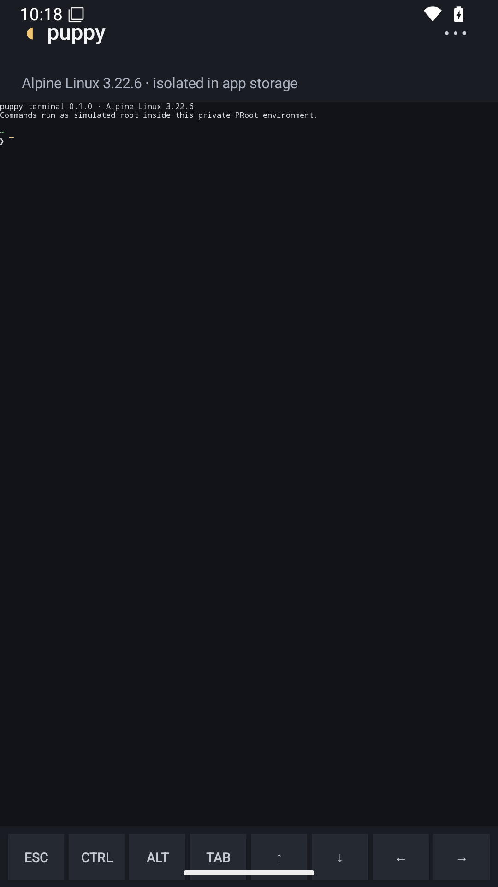

<div align="center">


# puppy Terminal

### A customizable Linux terminal environment for Android.

**Linux userspace • Alpine Linux • No root required • Built for Android**

[](#)
[](#linux-environment)
[](#project-status)

</div>

---

## 🐶 What is puppy?

**puppy** is a customizable Linux terminal emulator and userspace environment designed specifically for Android.

It provides a real Linux environment inside the Android application sandbox without requiring root access, an unlocked bootloader, or modifications to the Android system.

The current base system runs on **Alpine Linux 3.22.6**, chosen for its small size, simplicity and efficiency.

puppy is designed as a:

> **CPU-based terminal emulator with GPU support.**

Core terminal execution remains CPU-driven, while compatible devices can use the GPU for rendering, animations, smooth scrolling, blur and other visual effects.

---

## 📱 Interface

<div align="center">



</div>

The interface is intentionally simple.

The terminal is the main element of the application, while Android's own system keyboard remains the primary input method.

A typical puppy session currently looks like:

```console
puppy terminal 0.1.0 · Alpine Linux 3.22.6
Commands run as simulated root inside this private PRoot environment.

localhost:~#
```

The `root` environment shown inside puppy exists only inside its isolated Linux userspace.

It does **not** provide Android root access.

---

# ✨ Features

## 🏔️ Alpine Linux base

puppy currently uses:

```text
Alpine Linux 3.22.6
```

as its default Linux environment.

Alpine provides a lightweight foundation with access to a large package ecosystem while keeping the userspace relatively small.

---

## 📦 Package management

Packages can be installed using Alpine Linux's `apk` package manager.

For example:

```bash
apk update
apk upgrade
```

Install Git:

```bash
apk add git
```

Install Python:

```bash
apk add python3 py3-pip
```

Install Node.js:

```bash
apk add nodejs npm
```

Install development tools:

```bash
apk add clang make cmake git curl wget
```

Install editors:

```bash
apk add nano vim neovim
```

The goal is to make puppy capable of functioning as a real portable Linux development environment.

---

## 🐧 Real Linux userspace

puppy does not simply simulate the appearance of a Linux terminal.

It provides an isolated Linux userspace containing a familiar filesystem structure and Linux utilities.

The environment runs inside puppy's private application storage.

Example:

```text
/
├── bin
├── dev
├── etc
├── home
├── proc
├── root
├── tmp
├── usr
└── var
```

This environment is separated from Android itself.

---

## 🔒 No root required

puppy runs as a normal Android application.

It does not require:

- Android root access
- Magisk
- unlocked bootloader
- modified system partitions
- custom ROM
- privileged system permissions

Linux processes operate inside puppy's own isolated environment.

---

## ⌨️ Android keyboard integration

puppy uses the normal Android keyboard as its primary input system.

This means users can continue using keyboards such as:

- Gboard
- SwiftKey
- hardware keyboards
- Bluetooth keyboards
- USB keyboards

Terminal-specific controls can be provided separately without replacing the user's normal keyboard.

---

# 🎨 Customization

Customization is one of the main goals of puppy.

The terminal is being designed to support:

- custom fonts
- custom monospace fonts
- Nerd Fonts
- Powerline symbols
- configurable font size
- configurable line height
- ANSI themes
- true color
- cursor customization
- background images
- transparency
- background blur
- animations
- terminal profiles

The interface should remain minimal and terminal-focused rather than becoming a large mobile dashboard.

---

# 🚀 Interactive shell

puppy is developing an advanced interactive shell experience inspired by the behavior of **Fish** and the visual modularity of **Starship**.

The objective is to provide useful shell intelligence directly inside the mobile terminal.

### Planned functionality

- real-time syntax highlighting
- `$PATH` command validation
- invalid-command highlighting
- flag highlighting
- argument highlighting
- path highlighting
- inline autosuggestions
- command history
- fuzzy command correction
- Git branch detection
- Git status
- current directory information
- runtime detection
- previous command status
- command execution duration
- Nerd Font / Powerline support

Example:

```console
~/projects/puppy   main  Python 3.13
❯ git status
```

Another example:

```console
~/projects/web   dev !2  Node 24
❯ npm run dev
```

---

## Syntax highlighting

Commands should eventually be highlighted while they are typed.

Example:

```bash
git status --short
```

puppy can distinguish between:

```text
git        → valid command
status     → argument/subcommand
--short    → flag
```

An invalid command such as:

```bash
gti status
```

can be detected and visually marked before execution.

---

## Inline autosuggestions

puppy can use command history to provide Fish-style suggestions.

For example, after previously executing:

```bash
git status
```

typing:

```text
git s
```

could visually display:

```text
git status
```

with the remaining characters rendered as ghost text.

---

## Fuzzy command correction

puppy is also designed to recognize common command typos.

Examples:

```text
gti     → git
pyhton  → python
clera   → clear
```

Corrections should only be suggestions.

puppy should never silently execute a corrected command.

---

# ⚡ CPU-based with GPU support

puppy is primarily CPU-based.

The CPU remains responsible for:

- shell execution
- PTY communication
- Linux processes
- ANSI parsing
- package management
- filesystem operations
- command execution
- shell intelligence

The GPU may assist with presentation.

Supported GPU-assisted functionality can include:

- terminal rendering
- glyph compositing
- smooth scrolling
- cursor animations
- transitions
- transparency
- background blur

Core terminal functionality must continue working even without GPU acceleration.

---

# 🌫️ Blur

puppy's visual system is designed around an optional strong terminal background blur.

Default target:

```text
75%
```

The exact rendering method depends on Android version and hardware capabilities.

Fallback order:

```text
GPU blur
   ↓
Reduced blur
   ↓
Transparency
   ↓
Solid background
```

Visual effects must never have priority over terminal responsiveness.

---

# 🔋 Performance

puppy is designed to be both RAM-friendly and battery-friendly during normal usage.

When the terminal is idle, unnecessary rendering should stop.

During demanding tasks, puppy can dynamically allow higher resource usage.

Examples include:

- compilation
- package installation
- large Git operations
- heavy terminal output
- development servers
- graphical Linux sessions

The emulator itself should remain efficient while allowing Linux processes to use the performance they require.

---

## Adaptive graphics

Graphics can adapt according to device capability.

Possible profiles:

```text
Reduced
Balanced
Enhanced
```

### Reduced

Designed for weaker devices or battery-saving situations.

May reduce:

- animations
- blur
- transition quality
- GPU effects

### Balanced

Default mode for most devices.

Balances visual quality and efficiency.

### Enhanced

For capable hardware.

May enable:

- complete blur
- smoother animations
- high-refresh-rate rendering
- enhanced terminal transitions

---

# 🧠 RAM management

puppy is designed to avoid unnecessary memory usage.

Memory-sensitive components include:

- terminal scrollback
- glyph cache
- fonts
- command history
- shell metadata
- Git information
- background images
- rendering resources

Terminal history should have configurable limits.

For example:

```text
5,000 lines
10,000 lines
50,000 lines
```

Recommended default:

```text
10,000 lines
```

---

# 🛠️ Development tools

puppy aims to support a useful Linux development environment directly on Android.

Possible tools include:

### Languages

```text
Python
Node.js
JavaScript
TypeScript
C
C++
Go
Rust
Java
```

### Development utilities

```text
Git
SSH
curl
wget
make
CMake
Clang
GCC
npm
pip
Cargo
```

### Editors

```text
Nano
Vim
Neovim
```

Availability depends on the selected Linux distribution, Android architecture and upstream package support.

---

# 🖥️ GUI support

A future objective of puppy is to support graphical Linux applications.

This could allow Linux userspaces to run software such as:

```text
XFCE
Openbox
i3
xterm
graphical editors
Linux utilities
```

Possible display technologies include:

- integrated X11
- embedded graphical server
- Wayland-based solutions
- VNC/RFB fallback

GUI support is still experimental and should not currently be considered a stable feature.

---

# 📂 Android storage

puppy runs inside Android's application sandbox.

Access to Android files should use Android's supported storage APIs.

User-selected folders may eventually be exposed inside Linux as paths such as:

```text
/storage/downloads
/storage/documents
/storage/projects
```

puppy should not request unnecessary filesystem permissions.

---

# 🔐 Security

puppy does not attempt to bypass Android security.

The application should respect:

- Android sandboxing
- storage permissions
- application isolation
- Linux package signatures
- HTTPS downloads
- checksum verification
- safe archive extraction

The Linux root user inside puppy is not Android root.

---

# 📋 Quick information

| | |
|---|---|
| **Application** | puppy |
| **Type** | Linux terminal emulator |
| **Platform** | Android |
| **Base distribution** | Alpine Linux |
| **Current Alpine version** | 3.22.6 |
| **Primary architecture** | arm64-v8a |
| **Root required** | No |
| **Application ID** | `com.lunixdev.puppyterminal` |
| **License** | Apache License 2.0 |
| **Status** | Alpha |

---

# 📥 Installation

Download the latest APK from:

**GitHub → Releases**

Early versions of puppy are currently distributed as alpha builds.

Android may ask you to authorize APK installation from your browser or file manager.

> [!WARNING]
> puppy is currently under active development. Alpha versions may contain bugs, unfinished features or breaking changes.

---

# 🔨 Build from source

Clone the repository:

```bash
git clone https://github.com/imlunixdev/puppy.git
```

Enter the project:

```bash
cd puppy
```

Build a debug APK:

```bash
./gradlew assembleDebug
```

Run tests:

```bash
./gradlew test
```

The resulting APK will normally be generated inside the Android build output directory.

---

# 📁 Repository structure

```text
puppy/
├── app/
├── assets/
│   ├── puppy-logo.png
│   └── puppy-terminal.png
├── docs/
├── third_party/
├── build.gradle.kts
├── settings.gradle.kts
├── gradle.properties
├── README.md
├── LICENSE
├── NOTICE
├── CONTRIBUTING.md
└── THIRD_PARTY_LICENSES.md
```

---

# 🧪 Project status

puppy is currently in **alpha development**.

### Currently working

- Android application
- Alpine Linux userspace
- isolated application environment
- non-root Linux execution
- terminal interface
- Android keyboard
- Alpine shell
- basic Linux commands

### Under development

- improved PTY implementation
- persistent terminal sessions
- interactive prompt
- syntax highlighting
- autosuggestions
- fuzzy corrections
- Git prompt integration
- Nerd Font support
- terminal themes
- GPU-assisted rendering
- adaptive graphics
- background blur
- additional Linux distributions
- Linux GUI support

---

# 🗺️ Roadmap

```text
puppy
│
├── Terminal Core
│   ├── PTY
│   ├── ANSI / VT support
│   ├── UTF-8
│   ├── scrollback
│   └── sessions
│
├── Linux
│   ├── Alpine Linux
│   ├── package management
│   ├── development tools
│   └── additional distributions
│
├── Interactive Shell
│   ├── Starship-style prompt
│   ├── Fish-style highlighting
│   ├── autosuggestions
│   ├── fuzzy corrections
│   └── Git integration
│
├── Rendering
│   ├── GPU acceleration
│   ├── Nerd Fonts
│   ├── smooth scrolling
│   ├── animations
│   └── 75% blur
│
└── Future
    ├── graphical Linux applications
    ├── desktop environments
    └── expanded distro support
```

---

# 🤝 Contributing

Contributions and bug reports are welcome.

When contributing to puppy:

- keep terminal functionality above visual effects;
- avoid unnecessary dependencies;
- preserve Android sandbox compatibility;
- do not introduce root requirements;
- document third-party code;
- respect dependency licenses;
- keep the interface simple.

See:

[`CONTRIBUTING.md`](CONTRIBUTING.md)

for more information.

---

# 📜 Third-party software

puppy may bundle or interact with third-party software distributed under licenses different from puppy itself.

Third-party licensing information should be maintained in:

```text
THIRD_PARTY_LICENSES.md
NOTICE
```

Packages installed by users through Alpine Linux retain their original upstream licenses.

---

# ⚖️ License

puppy is licensed under the **Apache License 2.0**.

See:

[`LICENSE`](LICENSE)

for the complete license text.

---

<div align="center">


# puppy

<sub>terminal</sub>

**Linux in your pocket.**

</div>
